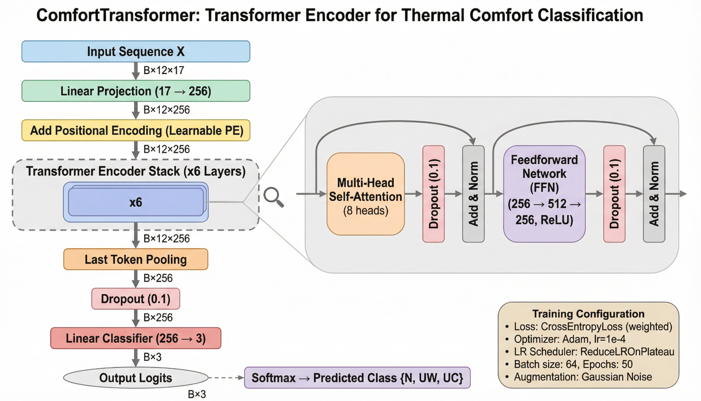

# T3C: Temporal Transformer for Thermal Comfort

[](https://www.python.org/downloads/)
[](https://pytorch.org/)
[](LICENSE)

> **Transformer-Based Thermal Comfort Classification Using the ASHRAE II Dataset for Smart Building Applications**
>


This repository contains the official implementation of the **Temporal Transformer for Thermal Comfort (T3C)** model and the **Physics-Informed Synthetic Sequential Generation (PISSG)** algorithm, as described in our paper.

---

## Overview

Traditional thermal comfort models (PMV, Random Forest, SVM, DNN) treat each occupant survey as an independent static snapshot, ignoring temporal dynamics like thermal adaptation, environmental memory, and cumulative exposure effects. **T3C** bridges this gap by:

1. **PISSG Algorithm** — Transforming static ASHRAE II survey records into physically plausible 60-minute temporal sequences via backward random walks with physics-constrained Gaussian noise.
2. **Geometric Delta Features** — Computing velocity vectors (∇x) that capture the *rate of environmental change*, enabling the model to distinguish "stable cool" from "rapidly cooling" trajectories.
3. **Transformer Encoder** — Using multi-head self-attention with O(1) access to any historical timestep, overcoming the sequential bottleneck and vanishing gradient limitations of LSTMs.

<p align="center">
  
</p>

## Key Results

| Metric | Score |
|---|---|
| Training Accuracy | 75.00% |
| Test Accuracy (unseen participants) | 70.66% |
| Macro F1 — Neutral | 0.70 |
| Macro F1 — Uncomfortably Warm | 0.69 |
| Macro F1 — Uncomfortably Cool | **0.75** |
| Train–Test Gap | 4.34 pp |

> The high F1 for "Uncomfortably Cool" demonstrates the model learned geometric cooling gradients rather than relying on static thresholds — a capability unique to temporal modeling.

---

## Repository Structure

```
T3C-Thermal-Comfort-Transformer/
├── README.md                   # This file
├── LICENSE                     # MIT License
├── requirements.txt            # Pinned dependencies
├── config.py                   # All hyperparameters in one place
├── src/
│   ├── __init__.py
│   ├── preprocessing.py        # Data loading, encoding, scaling
│   ├── pissg.py                # Physics-Informed Synthetic Sequential Generation
│   ├── model.py                # T3C Transformer architecture
│   ├── train.py                # Training loop with early stopping
│   └── evaluate.py             # Metrics, confusion matrix, classification report
├── scripts/
│   ├── run_train.py            # End-to-end training script
│   └── run_evaluate.py         # Standalone evaluation script
├── data/
│   └── README.md               # Instructions for obtaining the ASHRAE II dataset
├── notebooks/
│   └── T3C_walkthrough.ipynb   # Interactive demo notebook
├── saved_models/
│   └── .gitkeep                # Placeholder for trained weights
└── figures/
    └── .gitkeep                # Placeholder for architecture diagrams
```

---

## Quick Start

### 1. Installation

```bash
git clone https://github.com/<your-username>/T3C-Thermal-Comfort-Transformer.git
cd T3C-Thermal-Comfort-Transformer
pip install -r requirements.txt
```

### 2. Prepare the Dataset

Download the ASHRAE Global Thermal Comfort Database II and place the CSV file in `data/`. See [`data/README.md`](data/README.md) for detailed instructions.

### 3. Train the Model

```bash
python scripts/run_train.py --data_path data/df1.csv --epochs 55 --batch_size 64
```

### 4. Evaluate

```bash
python scripts/run_evaluate.py --data_path data/df1.csv --model_path saved_models/t3c_best.pth
```

---

## Configuration

All hyperparameters are centralized in [`config.py`](config.py). Key settings:

| Parameter | Value | Description |
|---|---|---|
| `seq_length` | 12 | Timesteps (12 × 5 min = 60 min history) |
| `d_model` | 256 | Transformer embedding dimension |
| `nhead` | 8 | Number of attention heads |
| `num_layers` | 6 | Transformer encoder layers |
| `dropout` | 0.10 | Dropout rate |
| `batch_size` | 64 | Training batch size |
| `learning_rate` | 1e-4 | Adam optimizer learning rate |
| `jitter_std` | 0.005 | Training-time augmentation noise |

Physics-informed noise scales for PISSG are also configurable — see the paper (Section 3.1) for physical justifications.

---

## Method: PISSG Algorithm

The **Physics-Informed Synthetic Sequential Generation** algorithm addresses the fundamental challenge that the ASHRAE II database contains only static survey snapshots with no temporal dimension:

```
Anchor (real survey at t=11) → Backward Random Walk → 12-step sequence → Geometric Deltas → [B×12×17] tensor
```

1. **Anchor Point**: Each real survey observation serves as the final timestep (t=11)
2. **Backward Walk**: Synthetic predecessors are generated by adding physics-constrained Gaussian noise only to *transient* variables (temperature, humidity, air velocity, metabolic rate, SET)
3. **Physical Clipping**: All generated values are clipped to physically plausible bounds
4. **Geometric Deltas**: Velocity vectors ∇x_t = x_t − x_{t−1} are appended, yielding 12 base + 5 delta = 17 features

See [`src/pissg.py`](src/pissg.py) for the full implementation.

---

## Citation

If you use this code in your research, please cite:

```bibtex
@article{hamid2026t3c,
  title={Transformer-Based Thermal Comfort Classification Using the ASHRAE II Dataset for Smart Building Applications},
  author={Hamid, Saeid and Lesan, Avijit and others},
  year={2026}
}
```

---

## License

This project is licensed under the MIT License — see [LICENSE](LICENSE) for details.

---

## Acknowledgments

- [ASHRAE Global Thermal Comfort Database II](https://www.ashrae.org/) for the dataset
- The PyTorch team for the deep learning framework
